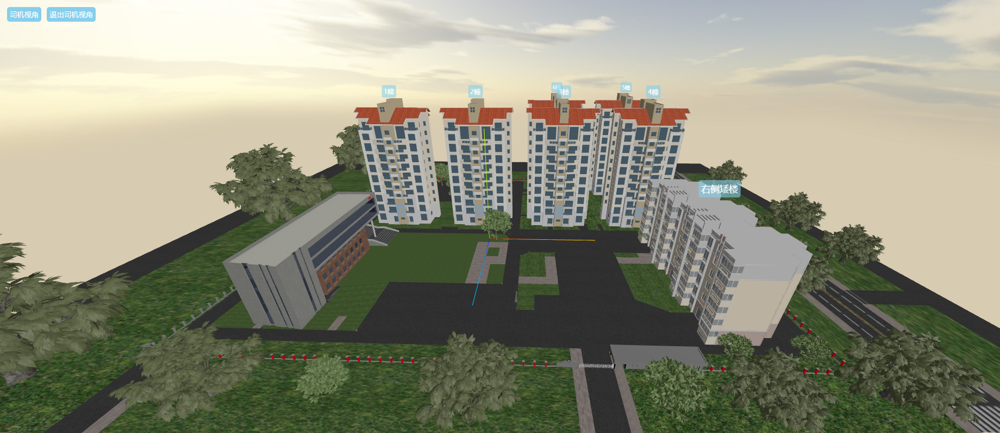
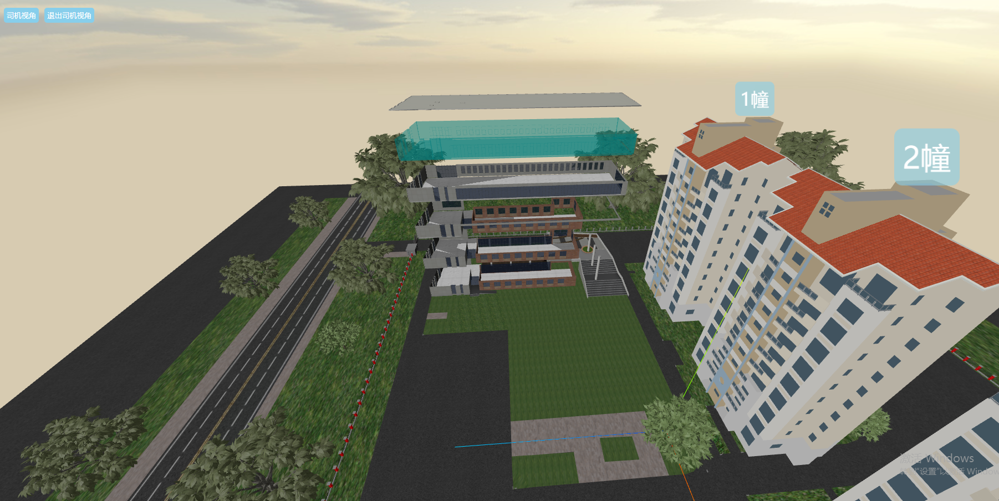
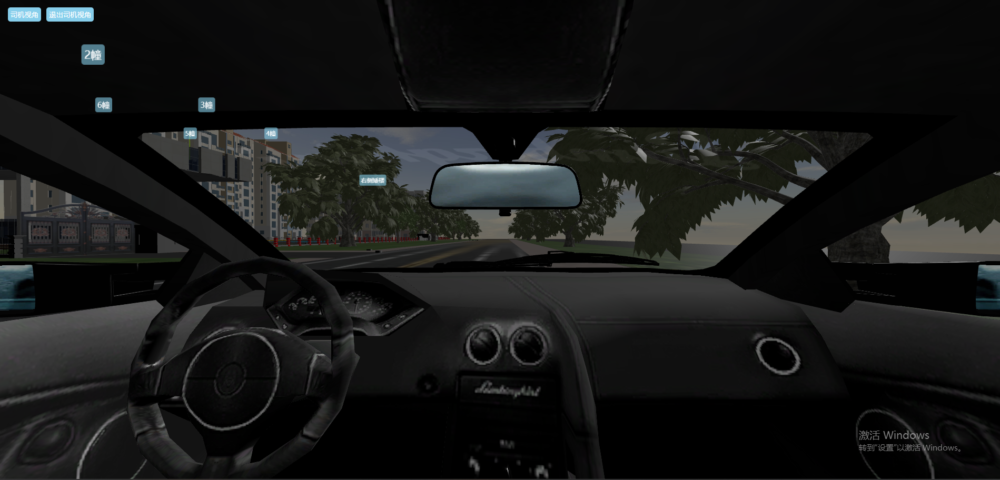

### 基于 Vue 3.0 + Three.js + Vite 的 Three.js 练手项目
#### 项目概述
本项目是一个基于 Vue 3.0、Three.js 和 Vite 搭建的 3D 图形展示项目。该项目以 three-park 开源项目为基础，经过修改和扩展，旨在提供一个学习和练习 Three.js 的平台。通过本项目，你可以深入了解 Three.js 的使用方法和 Vue 3.0 的新特性。
#### 项目安装与运行
首先，你需要确保你的系统中已经安装了 Node.js 和 npm（或 yarn、pnpm 等包管理工具）。然后，你可以通过以下命令来安装项目的依赖：
```
# 使用 pnpm 安装依赖  
pnpm install  
  
# 或者，如果你使用的是 npm  
npm install  
  
# 或者，如果你使用的是 yarn  
yarn install
```
要启动开发服务器，请运行以下命令：
```
# 使用 pnpm 启动开发服务器  
pnpm run dev  
  
# 或者，如果你使用的是 npm  
npm run dev  
  
# 或者，如果你使用的是 yarn  
yarn dev
```
这将启动一个开发服务器，并自动打开默认的浏览器窗口。你可以在这个窗口中看到项目的实时效果，并且任何对源代码的修改都会自动触发热重载，让你能够立即看到修改后的效果。

要构建生产版本的项目，请运行以下命令：
```
# 使用 pnpm 构建生产版本  
pnpm run build  
  
# 或者，如果你使用的是 npm  
npm run build  
  
# 或者，如果你使用的是 yarn  
yarn build
```
这将生成一个优化后的生产版本的项目，你可以将这个版本部署到你的服务器上。
#### 项目视角
##### 主视角
主视角是项目的默认视角，它展示了整个 3D 场景的全貌。你可以通过鼠标和键盘来控制视角的移动和旋转，以便从各个角度观察场景。

#### 拆楼视角
拆楼视角是一个特殊的视角，它允许你通过模拟拆除建筑物的过程来观察建筑物的结构。你可以使用鼠标和键盘来控制拆除过程，并观察建筑物在拆除过程中的变化。

#### 司机视角
司机视角是一个模拟驾驶的视角，它让你感觉就像是在驾驶一辆汽车一样。你可以通过鼠标和键盘来控制汽车的移动和转向，并观察汽车在场景中的行驶过程。

#### 感谢
感谢 three-park 的作者提供了这个优秀的开源项目，让我们能够在这个基础上进行学习和扩展。